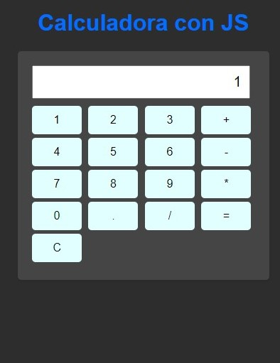

# Calculadora con JavaScript

Calculadora realizada en html y css, agregando sus funcionalidades como borrar todos los numeros o calcular un resultado, usando la etiqueta getElementById y trayendonos su valor que esta en el input.

## Resultado del proyecto
